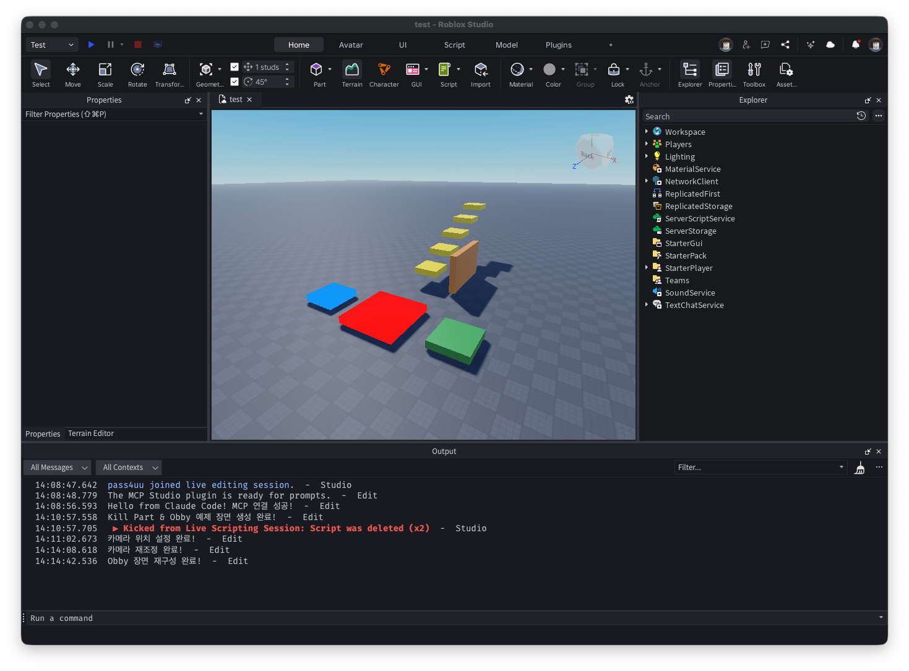
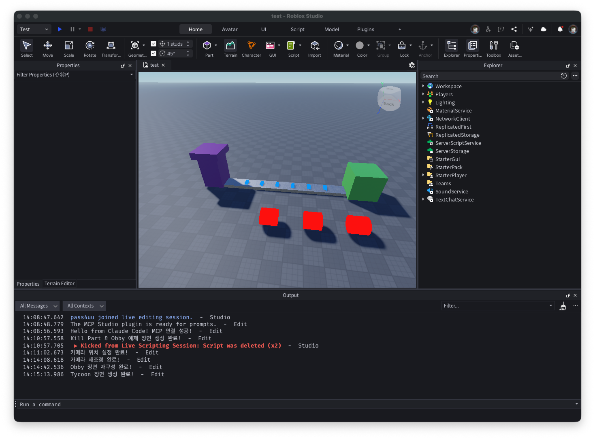

# 로블록스 루아 교육 Wiki

초등학생을 위한 로블록스 루아 스크립트 학습 사이트입니다.

> **사이트 바로가기**: https://soonyeol-huh.github.io/roblox-lua-wiki/

## 스크린샷

### Obby (장애물 코스) 예제


### Tycoon 예제


## 주요 기능

- **33주 커리큘럼** (11단계, 블록 코딩 → 텍스트 코딩 → 3D 모델링)
- 3개의 실습 프로젝트 (킬 파트, 리더보드, 상점 시스템)
- 게임 장르별 실습 (Obby, Tycoon, 시뮬레이터)
- 블렌더(Blender) 3D 모델링 및 로블록스 연동
- 엔트리 → 루아 변환표
- 디버깅 가이드 & 용어집

## 커리큘럼 개요

| 단계 | 기간 | 학습 내용 |
|------|------|----------|
| **1단계** | 1-3주차 | 로블록스 스튜디오 인터페이스와 3D 모델링 |
| **2단계** | 4-6주차 | 루아 스크립트 기초와 속성 제어 |
| **3단계** | 7-9주차 | 이벤트, 조건문, 서버/클라이언트 구조 |
| **4단계** | 10-12주차 | 시스템 구축과 게임 게시 |
| **5단계** | 13-15주차 | Rojo 플러그인을 통한 외부 에디터 연동 |
| **6단계** | 16-18주차 | 고급 GUI 만들기 |
| **7단계** | 19-21주차 | DataStore, 사운드, 애니메이션 |
| **8단계** | 22-24주차 | 게임 장르 만들기 (Obby, Tycoon, 시뮬레이터) |
| **9단계** | 25-27주차 | 블렌더 기초 (인터페이스, 뷰포트 조작, 기본 오브젝트) |
| **10단계** | 28-30주차 | 블렌더 3D 모델링 (로블록스 에셋 제작, UV 매핑, 텍스처) |
| **11단계** | 31-33주차 | 블렌더 → 로블록스 연동 (메시 익스포트/임포트, 리깅, 애니메이션) |

## 기술 스택

- [Docusaurus 3](https://docusaurus.io/) - React 기반 문서 사이트 프레임워크
- TypeScript
- Lua 코드 구문 하이라이팅
- GitHub Pages 자동 배포 (GitHub Actions)

## 설치 및 실행

```bash
# 의존성 설치
npm install

# 개발 서버 실행
npm run start

# 빌드
npm run build
```

## 프로젝트 구조

```
docs/
├── intro.md                        # 소개 페이지
├── curriculum/
│   ├── week-01-03/                 # 1단계: 스튜디오 기초
│   ├── week-04-06/                 # 2단계: 루아 기초
│   ├── week-07-09/                 # 3단계: 이벤트/조건문/서버-클라이언트
│   ├── week-10-12/                 # 4단계: 시스템 구축
│   ├── week-13-15/                 # 5단계: Rojo/외부 에디터
│   ├── week-16-18/                 # 6단계: GUI 만들기
│   ├── week-19-21/                 # 7단계: DataStore/사운드/애니메이션
│   ├── week-22-24/                 # 8단계: Obby/Tycoon/시뮬레이터
│   ├── week-25-27/                 # 9단계: 블렌더 기초
│   ├── week-28-30/                 # 10단계: 블렌더 3D 모델링
│   └── week-31-33/                 # 11단계: 블렌더→로블록스 연동
├── projects/
│   ├── kill-part.md                # 킬 파트 프로젝트
│   ├── leaderboard.md              # 리더보드 프로젝트
│   └── proximity-prompt.md         # 상점 시스템 프로젝트
├── reference/
│   ├── entry-to-lua.md             # 엔트리→루아 변환표
│   └── debugging.md                # 디버깅 가이드
└── glossary.md                     # 용어집
```

## 라이선스

MIT
